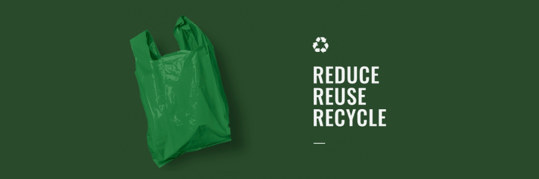

# ♻️ Scrap.py ♻️

>Proyek ini dibuat untuk memenuhi tugas Proyek Akhir Semester (PAS) pada mata kuliah Pemrograman Berbasis Platform (CSGE602022) yang diselenggarakan oleh Fakultas Ilmu Komputer, Universitas Indonesia pada Semester Gasal, Tahun Ajaran 2022/2023.

## ⚒️ Tools ⚒️

## 👤 Anggota Kelompok 👤
- [Laela Putri Salsa Biella - 2106751562](https://github.com/salsabiellalp)
- [Inez Bungaria Octaviana Pardede - 2106751833](https://github.com/InezBungaria)
- [Givarrel Veivel Pattiwael - 2106640341](https://github.com/Veivel)
- [Abraham Javier Sebastian Situmorang - 2106704364](https://github.com/ajsebastians)
- [Arkan Alexei Andrei - 2106631463](https://github.com/arkanalexei)

## 📝 Ringkasan 📝
Indonesia merupakan negara produsen sampah terbesar di seluruh Asia. Faktanya, kita menghasilkan 67,8 juta ton sampah pada tahun 2021. Produksi sampah Indonesia pada tahun 2022 diperkirakan mencapai 68,8 juta ton.

Scrap.py adalah sebuah organisasi non profit yang bertujuan untuk mengurangi jumlah sampah dengan mendaur ulang dan mengelola sampah dengan baik. Kami bekerja dengan sukarelawan untuk mengolah sampah-sampah anda untuk masa depan yang lebih cerah.

*Cleaning the environment, one scrap at a time.*

## 📃 Modules + Kontrak Kinerja 📃
### Register/Login @Arkan
Halaman untuk membuat akun atau login. Tipe user yang login akan mempengaruhi akses serta tampilan pada websitenya.
### Home @Arkan
Tampilan utama website. Menampilkan informasi umum mengenai websitenya. Hal-hal seperti statistik seputar sampah dunia, teknis deposit sampah, dan lain-lain.
### About Us + Contact @Bastian
Halaman untuk mengetahui informasi lebih jauh mengenai organisasi dan apa yang kami lakukan. Halaman ini akan menampilkan latar belakang munculnya organisasi, visi dan misi, dan daftar anggota organisasi. Selain itu, halaman ini akan menampilkan daftar kontak yang dapat dihubungi dan form feedback yang dapat diisi jika mempunyai kesan dan pesan.

### News/Blog @Arkan
Halaman dimana admin bisa menulis dan menerbitkan artikel baru. Tipe user selain admin hanya bisa melihat artikel-artikel tersebut.

### Deposit Sampah @Veivel
Halaman dimana user yang sudah login dapat mensubmit form untuk deposit sampah ke sistem bank sampah. User bisa menentukan jumlah sampah deposit dan tipe sampahnya (yang sudah pre-determined). Tergantung deposit yang dilakukan, user akan mendapatkan poin di *balance*nya yang nanti dapat ditukar.

### Point Leaderboard @Bella
Halaman papan peringkat. Menampilkan user dengan point tertinggi. Tampilan user diurutkan berdasarkan point yang diperoleh user selama menggunakan website.

### Tukar Poin @Inez
Halaman untuk user menukar poin hasil deposit sampah menjadi voucher/perks. Hanya dapat diakses oleh user yang sudah memiliki akun dan login.

### Green Footprint Calculator @ Arkan
Kalkulator jumlah *Greenhouse Emissions* yang telah dikurangi oleh user dengan melakukan deposit ke bank sampah. Jumlah tersebut akan ditampilkan pada halaman home user.

## 👨‍💻 Role Pengguna 👨‍💻
### 👤 Admin 👤
- Admin dapat membuat artikel baru di halaman news/blog.

### 🔒 User Yang Tidak Login 🔒
- User bisa melihat artikel yang sudah dipublish admin
- User bisa melihat feedback dan rating di halaman about us
- User bisa melihat profil organisasi, visi dan misi organisasi, dan daftar anggota organisasi di halaman about us
- User bisa melihat point leaderboard

### 🔑 User Yang Sudah Login 🔑
- User bisa melihat artikel yang sudah dipublish admin
- User bisa mengirim feedback dan rating melalui form di halaman about us
- User bisa menghapus feedback dan rating melalui dashboard history.
- User bisa melihat point leaderboard
- User bisa deposit sampah
- User bisa menukar poin
- User bisa melihat green footprint mereka

## 🌐 Integrasi Web 🌐
Membuat fungsi fetch yang mengembalikan Future sebuah tipe data secara asinkronus dari endpoint heroku. Endpoint tersebut disimpan pada var url.
